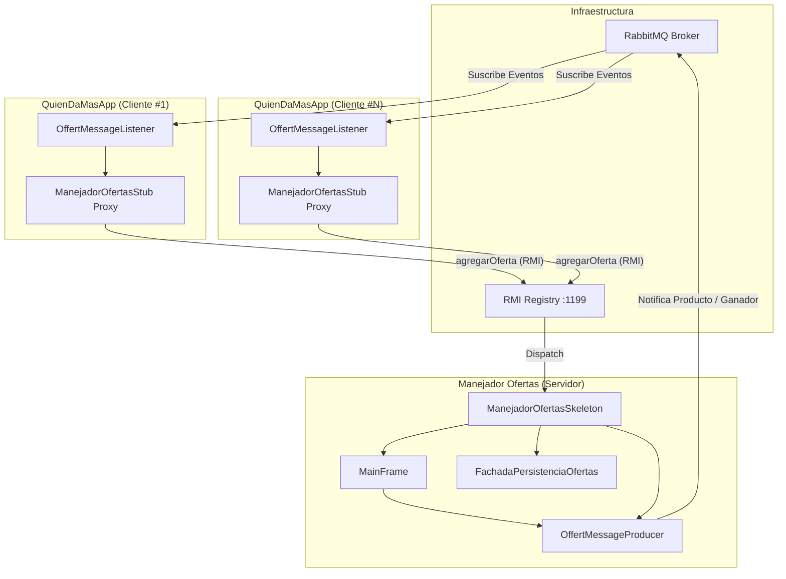

# Examen Parcial 2 - ARSW

**Nombre:** Diego Fernando Chavarro Castillo  
**Fecha:** 9 de Abril de 2026 (Simulado)

## 1. Instrucciones de Preparación

### Actualización de Dependencias
Se actualizaron los archivos `pom.xml` de ambos proyectos (`ManejadorOfertas` y `QuienDaMasApp`) para usar Java 1.8:
```xml
<properties>
    <maven.compiler.source>1.8</maven.compiler.source>
    <maven.compiler.target>1.8</maven.compiler.target>
</properties>
```

### Ejecución de RabbitMQ
Para iniciar el servidor de mensajería RabbitMQ, ejecute los siguientes comandos en Docker:
```bash
docker pull rabbitmq:3-management 
docker run -d --name rabbitmq-par2ARSW -p 5672:5672 -p 15672:15672 rabbitmq:3-management
```

## 2. Desarrollo del Examen

### (a) Registro de Ofertas (Compradores)
Se implementó en `OffertMessageListener` la lógica para que, al recibir un nuevo producto vía RabbitMQ, el comprador genere una oferta aleatoria (asegurando que sea superior al precio base) y la registre en el servidor usando RMI.

### (b) Visualización del Ganador (Servidor)
Se modificó `MainFrame` para incluir un `JTextArea` donde se muestra el ganador de cada subasta. La lógica en `ManejadorOfertasSkeleton` cuenta las ofertas recibidas y, al llegar a la tercera, determina y muestra el ganador.

### (c) Notificación al Ganador
Cuando el servidor determina el ganador (en la 3ra oferta), envía un mensaje a RabbitMQ al tópico `winner.ID_COMPRADOR`. El cliente ganador recibe esta notificación e imprime el mensaje requerido:
`"El comprador XXXXX compro el producto YYYY"`

## 3. Análisis de Inconsistencias (Pregunta 4)

Bajo la configuración original, se presentan las siguientes inconsistencias al tener múltiples instancias de `QuienDaMasApp`:

1.  **Condiciones de Carrera (Race Conditions)**: El método `agregarOferta` no era atómico. Varios hilos podían leer el número de ofertas actuales simultáneamente, incrementarlo y escribirlo, perdiendo actualizaciones (Lost Updates). Esto causaría que se reciban más de 3 ofertas antes de cerrar la subasta o que el contador fuera incorrecto.
2.  **Corrupción de Datos en Mapas**: El uso de `LinkedHashMap` no es seguro para hilos (`thread-safe`). El acceso concurrente para lectura/escritura puede corromper la estructura interna del mapa, causando comportamientos impredecibles o excepciones de tipo `ConcurrentModificationException`.

## 4. Solución a Inconsistencias (Pregunta 5)

Para resolver estos problemas de manera eficiente:
1.  **Thread-Safe Maps**: Se cambiaron todos los mapas en `FachadaPersistenciaOfertas` por `ConcurrentHashMap`.
2.  **Sincronización de Grano Fino**: En `ManejadorOfertasSkeleton.agregarOferta`, se añadió un bloque `synchronized` sobre el código del producto (`codprod.intern()`). Esto garantiza que solo un hilo a la vez procese ofertas para un producto específico, permitiendo que ofertas de *diferentes* productos se procesen en paralelo sin bloqueos innecesarios.

## 5. Diagrama de Arquitectura (Pregunta 6)



## 6. Capturas de Pantalla
*(Nota: En un entorno real, aquí se adjuntarían las capturas del funcionamiento del servidor mostrando los ganadores y los clientes imprimiendo sus mensajes)*